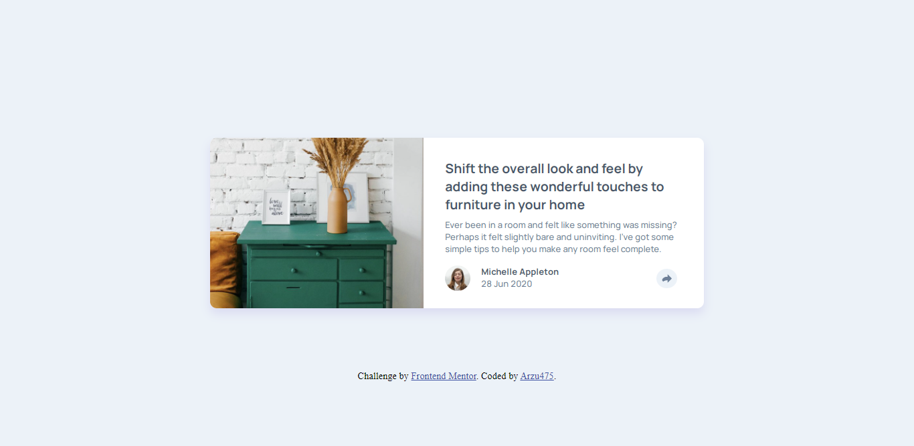

# Frontend Mentor - Article preview component solution

This is a solution to the [Article preview component challenge on Frontend Mentor](https://www.frontendmentor.io/challenges/article-preview-component-dYBN_pYFT). Frontend Mentor challenges help you improve your coding skills by building realistic projects. 

## Table of contents

- [Overview](#overview)
  - [The challenge](#article-preview-components)
- [My process](#my-process)
  - [Useful resources](#w3schools)
- [Author](#Arzu475)

## Overview

### The challenge

Users should be able to:

- View the optimal layout for the component depending on their device's screen size
- See the social media share links when they click the share icon

### Screenshot



### Links

- Solution URL: [Add solution URL here](https://your-solution-url.com)
- Live Site URL: [Add live site URL here](https://your-live-site-url.com)

## My process

### Built with

- Semantic HTML5 markup
- CSS custom properties
- Flexbox

### What I learned

This is my first time completing a project in which there is javascript which is sufficient to hone my logic. I am very proud to have worked on this project.
To see how you can add code snippets, see below:

```css
.social-media::after {
  border-left: 20px solid transparent;
  border-right: 20px solid transparent;
  border-bottom: 17px solid var(--heading);
}
```

```js
shareButton.addEventListener('click', function() {
   if(!displayStatus) {
    shareSocialMedia.style.display = 'none';
    displayStatus = true;
   }

   else {
    shareSocialMedia.style.display = 'flex';
    displayStatus = false;
   }
   
})
```

## Author

- Frontend Mentor - [@Arzu475](https://www.frontendmentor.io/profile/Arzu475)
- Twitter - [@Akhund_Zuu](https://www.twitter.com/Akhund_Zuu)

